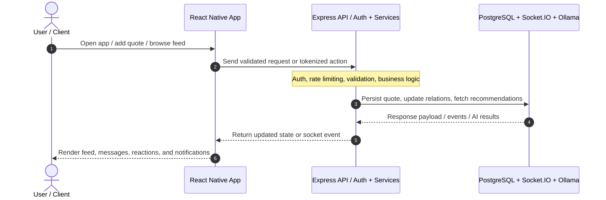

<div align="center">

# Daily Quotes

**Daily Quotes helps people discover, save, and share meaningful ideas in a social, mobile-first experience that turns everyday inspiration into a habit of reflection and connection**

[](https://expo.dev/)
[](https://reactnative.dev/)
[](https://www.typescriptlang.org/)
[](https://expressjs.com/)
[](#-license--author)

</div>

---

## 📌 Problem & Motivation

People often collect quotes in scattered notes, messages, and social feeds without a dedicated place to discover thoughtful perspectives, interact with others, or revisit meaningful moments later. Existing solutions rarely combine content discovery, social interaction, and personal reflection in a single flow.

**Daily Quotes** addresses this by streamlining the entire experience:

- **Discoverability:** Curated, searchable, and mood-aware quote exploration turns inspiration into a daily habit.
- **Social context:** Friends, reactions, comments, and messaging give quotes a conversation layer instead of isolated content.
- **Personal ritual:** Zen mode, notifications, and journaling help users turn reading into mindful reflection rather than passive scrolling.

---

## ✨ Key Features

- **⚡ Quote Feed & Discovery:** Publish and browse quotes, react with meaningful emotions, and explore personalized content by mood and context.
- **💬 Social Interaction:** Build friendships, chat in real time, and participate in comments and conversations around quotes.
- **🔒 Secure Auth & Sessions:** JWT-based authentication, session tracking, and protected routes keep user access controlled and reliable.
- **📱 Cross-Platform Experience:** Run the app on mobile, web, and emulator targets with Expo while the backend serves shared data and notifications.
- **🧠 AI-Assisted Search:** Use semantic and mood-focused discovery patterns with optional Ollama-based embeddings for richer recommendations.
- **🌙 Zen Mode:** Enter a focused, distraction-free quote experience with ambient audio and reflection support.

---

## 🧠 Architecture & How It Works

<p align="center">
  
</p>

<p align="center">
  
</p>



## 🛠️ Tech Stack

| Category | Technology | Purpose / Highlights |
|---|---|---|
| Frontend / Client | React Native + Expo + React Navigation | Mobile-first UI, native runtime support, and cross-platform delivery. |
| Language & Runtime | TypeScript 5.9 + Node.js 18+ | Strong typing for the app and API, with modern JavaScript runtime support. |
| State / Architecture | Context API + custom hooks + REST + WebSockets | Simple, responsive app state management with real-time social features. |
| APIs & Tooling | Express 5, Socket.IO, PostgreSQL + pgvector, JWT, Zod, Docker Compose | Secure API layer, real-time messaging, vector search, and local infrastructure. |
| Deployment / Target | Android / iOS / Web via Expo + backend containerized services | Flexible runtime targeting for mobile and browser development. |

## 🚀 Getting Started

### Prerequisites

- **Node.js:** 18+
- **Docker + Docker Compose:** Required for PostgreSQL and local service orchestration
- **Expo Go (optional):** For testing the app on a physical device

### 1. Installation

```bash
git clone https://github.com/coxteen/daily-quotes.git
cd daily-quotes

# Install backend dependencies
cd backend && npm install

# Install frontend dependencies
cd ../frontend && npm install
```

### 2. Environment Configuration

Create a `.env` file inside the `backend` folder by copying the example file:

```bash
cd backend
cp .env.example .env
```

Then fill in the required values:

```env
PORT=3000
DB_USER=your_db_user
DB_PASSWORD=your_db_password
DB_HOST=localhost
DB_PORT=5432
DB_NAME=daily_quotes_postgres_db
JWT_SECRET=your_secure_jwt_secret_key_here_change_this_for_production
```

| Variable | Source | Description |
|---|---|---|
| `DB_USER` | User-defined | Database username used by the backend service. |
| `DB_PASSWORD` | User-defined | Database password for the local PostgreSQL instance. |
| `JWT_SECRET` | User-defined | Secret key used to sign and verify user sessions. |

> ⚠️ **Security Notice:** Never commit `.env` files, production credentials, or signing keys to version control.

### 3. Running Locally

Start the database:

```bash
docker compose up -d
```

Start the backend:

```bash
cd backend
npm run db:seed
npm run dev
```

Start the frontend:

```bash
cd frontend
npm start
```

Open the Expo dev tools or scan the QR code in Expo Go on a connected device.

## ⚙️ Configuration

Core runtime and validation settings are centralized in the backend configuration layer, especially in files such as `backend/src/utils/envValidator.ts` and `backend/src/config/db.ts`.

```ts
export const SERVER_CONFIG = {
  port: Number(process.env.PORT ?? 3000),
  jwtExpiryDays: 30,
  maxUploadMb: 10,
  enableAiSearch: Boolean(process.env.OLLAMA_BASE_URL),
};
```

## 📄 License & Author

- **Author:** [Costin Ghiujan](https://github.com/coxteen)
- **License:** Released under the [MIT License](LICENSE).
